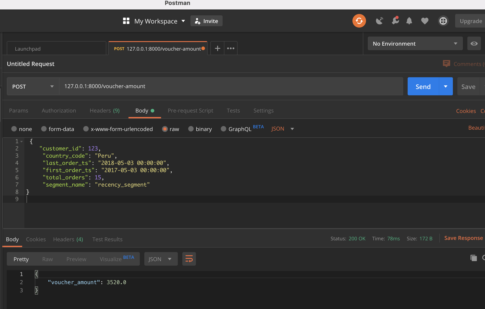

# fast-api

## Introduction
Project setup for loading customer segments into postgres DB, and retrive voucher amount via REST API

## Getting Started

### Project structure explanation
```
fast-api
|   README.md                                   # Project description
|   docker-compose.yml                          # Flask API, Postgres and Data loader containers description
|
└───data                                        # Sample data provided
|   | data.parquet.gzip                         # Events sample data
|
└───docker                                      # Docker files
|   |               
|   └───api
|   |   | Dockerfile                            # Flask Docker definition
|   |   | requirements.txt                      # Python dependencies
|   |   |
|   └───data_loader
|   |   | Dockerfile                            # Data loader Docker definition
|   |   | requirements.txt                      # Python dependencies
|   |   |
|   └───postgres
|   |   | Dockerfile                            # Postgres Docker definition
|   |   └───scripts                             # Intial postgres setup scripts 
|   |   |   | 1_init.sql                        # Data loader Docker definition
|   |
└───src
|   |
|   └───analysis
|   |   | data_analysis.py                      # Initial data analysis script
|   |   |
|   └───api
|   |   | main.py                               # Main api definiation
|   |   |
|   |   └───test
|   |   |   | test_main.py                      # Unit test suite for API
|   |   |
|   └───data_loader
|   |   | main.py                               # ETL script
```

### Requirements
* Install [Docker](https://www.docker.com/)
* Install [Docker Compose](https://docs.docker.com/compose/install/)

### Clone repository to local machine
```
git clone https://github.com/ajaykammardi/fast-api.git
```

### Change directory to local repository
```
cd fast-api
```

### Start the containers
```
docker-compose up -d
```

On successful docker start pipeline would be triggered automatically and loads the `customer_voucher_segments` table.

### Connecting Postgres DB from local to check data
via command line
```
psql -h localhost -U postgres_user -p 5433 -d postgres_db -W postgres
```
or via pgAdmin/ any other GUI tools
```
host=localhost
user=postgres_user
password=postgres
port=5433
database=postgres_db
```

### Running Unit test
```
docker exec -it voucherapi pytest -v /app
```

### REST API output from Postman



### Cleaning up
To Stop and delete containers, delete volumes with database data and download images, run:
```
docker-compose down --volumes --rmi all
```